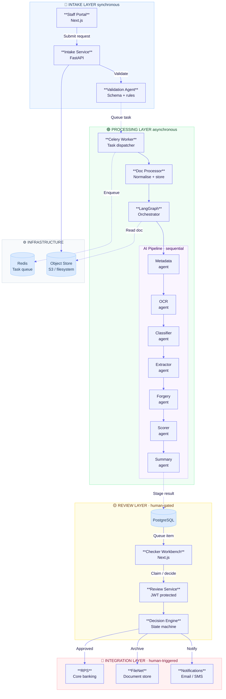
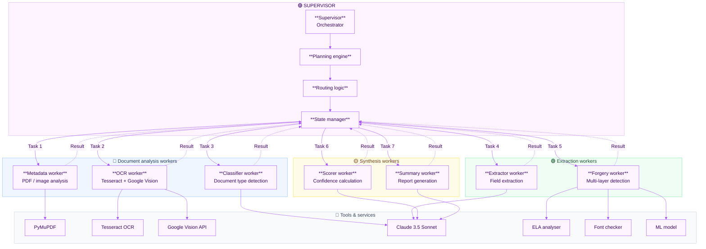
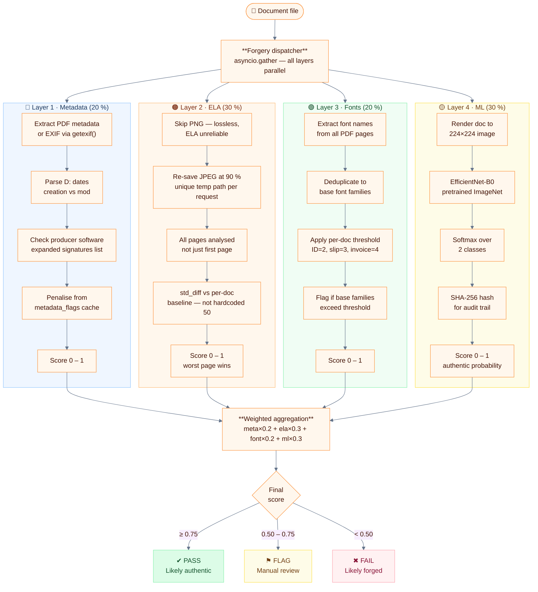
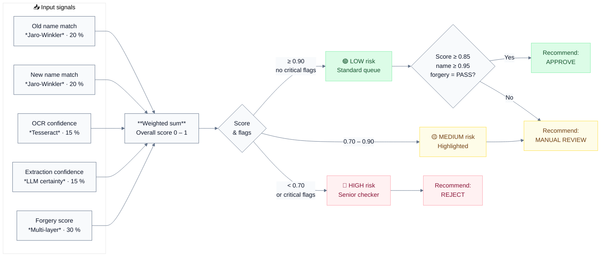
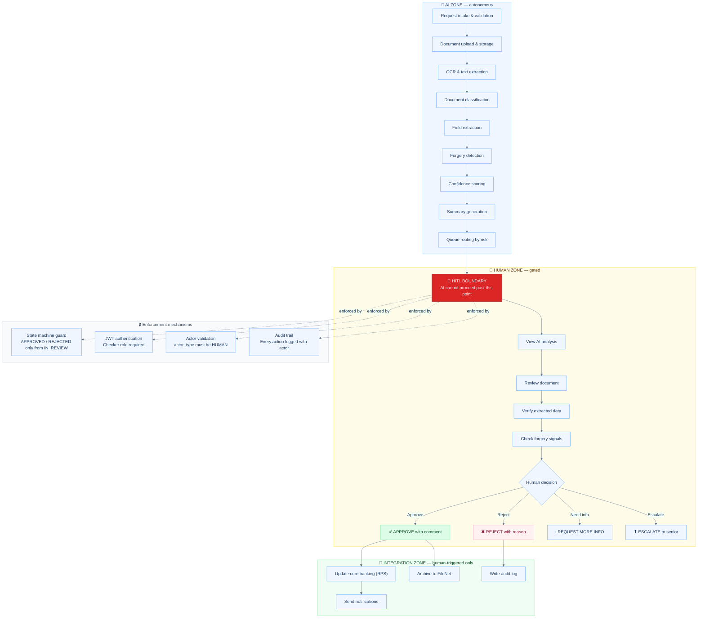
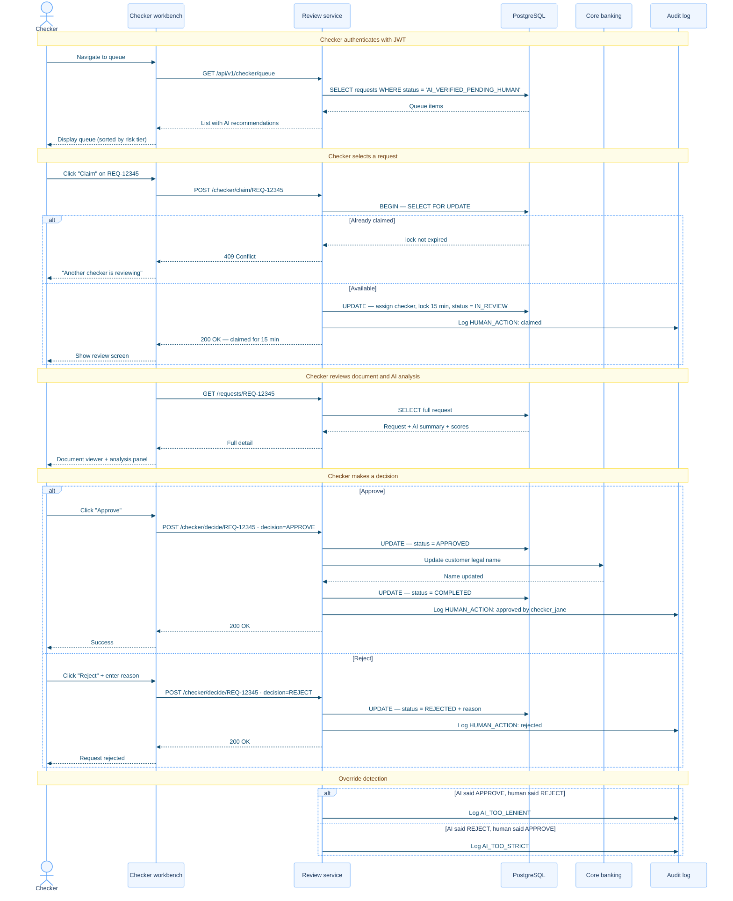
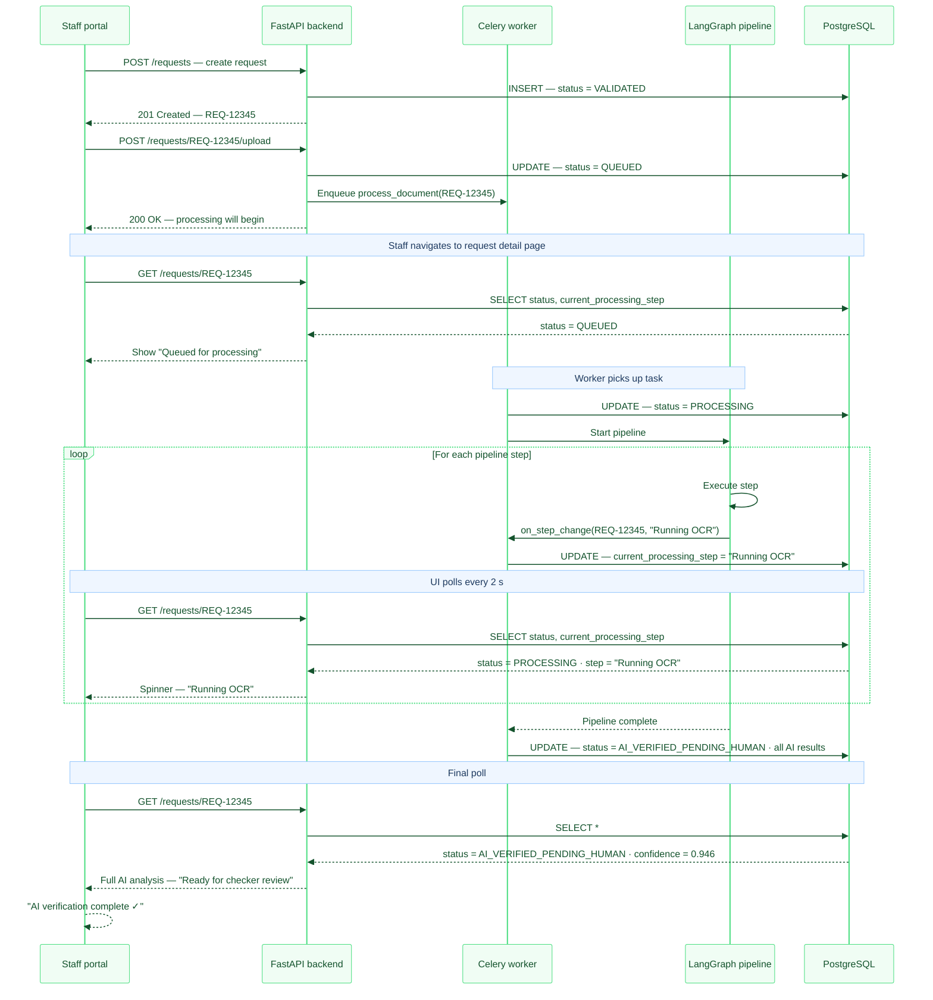

# IASW Architecture & Design Document

This document provides the complete system architecture, agent design, AI/ML implementation, and Human-in-the-Loop (HITL) design for the Intelligent Account Servicing Workflow (IASW) system.

---

## Table of Contents

1. [Executive Summary](#1-executive-summary)
2. [System Architecture](#2-system-architecture)
3. [Visual Architecture Diagrams](#3-visual-architecture-diagrams)
4. [Agent Design](#4-agent-design)
5. [AI/ML Implementation](#5-aiml-implementation)
6. [Human-in-the-Loop Design](#6-human-in-the-loop-design)
7. [Data Model](#7-data-model)
8. [Technology Stack Justification](#8-technology-stack-justification)
9. [Observability & Operations](#9-observability--operations)
10. [Trade-offs & Design Decisions](#10-trade-offs--design-decisions)

---

## 1. Executive Summary

### 1.1 What is IASW?

The **Intelligent Account Servicing Workflow (IASW)** is an AI-powered document verification system that automates the processing of customer account change requests for banks. When a customer wants to change their legal name on their bank account (e.g., after marriage), they must submit supporting documents like a marriage certificate. IASW uses AI to verify these documents, extract relevant information, detect potential forgery, and route requests to human checkers for final approval.

### 1.2 The Problem It Solves

**Before IASW:**
- Bank staff manually review each document (time-consuming)
- Inconsistent verification quality across different staff members
- No systematic forgery detection
- Paper-based audit trails prone to gaps
- High operational cost per request

**After IASW:**
- AI pre-processes documents and extracts key fields automatically
- Consistent verification using multi-layer analysis (OCR, forgery detection, name matching)
- Human checkers focus on decision-making, not data extraction
- Complete digital audit trail with tamper detection
- Risk-based routing ensures high-risk cases get senior review

### 1.3 Core Principle

**"AI assists, humans decide."** The system never auto-approves requests. Every change to a customer's bank account requires explicit human approval. AI provides recommendations and analysis; humans make the final call.

### 1.4 Scope

**In Scope (Current Implementation):**
- Legal Name Change requests
- Supporting documents: Marriage Certificate, Gazette Notification, Deed Poll, Court Order
- Document ingestion, OCR, classification, field extraction
- Multi-layer forgery detection
- Confidence scoring and risk-based routing
- Human checker review workflow
- Complete audit trail

**Out of Scope (Future Phases):**
- Other account servicing requests (address change, KYC refresh)
- Customer self-service portal
- External government API verification

---

## 2. System Architecture

### 2.1 Architecture Overview

The system is organized into four distinct layers, each with clear boundaries and responsibilities. See [Diagram 1](#diagram-1-high-level-system-architecture) in the Visual Architecture Diagrams section for the complete overview.

### 2.2 Boundary Summary

| Boundary | Type | What Happens |
|----------|------|--------------|
| Intake → Processing | **ASYNC** | Staff get a reference number and are released. Heavy AI processing happens in background. |
| Processing → Review | **STAGING** | AI writes results to database with status `AI_VERIFIED_PENDING_HUMAN`. Request enters checker queue. |
| Review → Integration | **HITL GATE** | Human checker must approve. Only human approval can trigger core banking update. |

### 2.3 Component Responsibilities

| Component | Technology | What It Does |
|-----------|------------|--------------|
| **Staff Portal** | Next.js 14, TypeScript | Web interface for bank staff to submit change requests and upload documents |
| **Checker Workbench** | Next.js 14, TypeScript | Web interface for checkers to review AI analysis and make approve/reject decisions |
| **API Gateway** | FastAPI (Python) | REST API handling authentication, routing, and business logic |
| **Task Queue** | Celery + Redis | Manages async document processing with retry logic |
| **AI Pipeline** | LangGraph + Claude | Orchestrates AI agents for document verification |
| **Database** | PostgreSQL + SQLAlchemy | Stores requests, audit logs, customer data |
| **Document Storage** | Local filesystem | Stores uploaded documents |

---

## 3. Visual Architecture Diagrams

> **Comprehensive visual system design reference**

### Table of Contents

| # | Diagram | Purpose | Best For |
|---|---------|---------|----------|
| [1](#diagram-1-high-level-system-architecture) | **High-Level System Architecture** | 4-layer overview | First-time viewers, executive summary |
| [2](#diagram-2-supervisor-worker-agent-architecture) | **Supervisor-Worker Architecture** | Agent orchestration | AI pipeline deep dive |
| [3](#diagram-3-langgraph-pipeline-with-conditional-routing) | **LangGraph Pipeline** | Processing flow with routing | Implementation details |
| [4](#diagram-4-forgery-detection-multi-layer) | **Forgery Detection** | 4-layer security analysis | Security review |
| [5](#diagram-5-confidence-scoring-model) | **Confidence Scoring** | Score calculation logic | Quality assurance |
| [6](#diagram-6-human-in-the-loop-boundaries) | **HITL Boundaries** | AI vs Human zones | Compliance & governance |
| [7](#diagram-7-database-schema-erd) | **Database Schema** | Entity relationships | Database design |
| [8](#diagram-8-checker-workflow-sequence) | **Checker Workflow** | Human review process | User training |
| [9](#diagram-9-real-time-processing-updates) | **Real-Time Updates** | Polling mechanism | Performance optimization |

---

### Diagram 1: High-Level System Architecture

**Purpose:** Shows the complete 4-layer architecture with clear boundaries  
**Key Insight:** Async boundary after intake, HITL gate before integration



**Key Components:**
- **Intake Layer:** Synchronous validation, then staff released
- **Processing Layer:** Async AI pipeline, 7 specialized agents
- **Review Layer:** Human checkpoint, JWT-protected
- **Integration Layer:** Only triggered by human approval

---

### Diagram 2: Supervisor-Worker Agent Architecture

**Purpose:** Shows how supervisor orchestrates 7 specialized worker agents  
**Key Insight:** Clean separation of concerns, each worker has specific tools



**Worker Responsibilities:**
- **Analysis:** Metadata extraction, OCR, document classification
- **Extraction:** Field extraction, forgery detection
- **Synthesis:** Score calculation, summary generation

---

### Diagram 3: LangGraph Pipeline with Conditional Routing

**Purpose:** Detailed processing flow with decision points  
**Key Insight:** Fallback OCR when confidence low, skip forgery on type mismatch

```mermaid
%%{init: {
  'theme': 'base',
  'themeVariables': {
    'primaryColor': '#f0f9ff',
    'primaryTextColor': '#0c4a6e',
    'primaryBorderColor': '#0ea5e9',
    'lineColor': '#64748b',
    'background': '#ffffff',
    'fontFamily': 'ui-sans-serif, system-ui, sans-serif',
    'edgeLabelBackground': '#f8fafc'
  }
}}%%
graph TD
    START(["▶ Start"]) --> VALIDATE{"Validate<br/>document"}

    VALIDATE -->|Pass| METADATA["**Extract metadata**<br/>PDF dates · software · EXIF"]
    VALIDATE -->|Fail| END_FAIL(["✖ Validation failed"])

    METADATA --> OCR["**Run OCR**<br/>Tesseract"]

    OCR --> CHECK_OCR{"OCR<br/>confidence<br/>≥ 60%?"}
    CHECK_OCR -->|Yes| CLASSIFY
    CHECK_OCR -->|No| FALLBACK["**Fallback OCR**<br/>Google Vision"]
    FALLBACK --> CLASSIFY["**Classify document**<br/>Marriage cert · Gazette · etc.<br/><br/>Compare with declared type"]

    CLASSIFY --> CHECK_TYPE{"Declared type<br/>matches<br/>detected type?"}
    
    CHECK_TYPE -->|✓ Match| EXTRACT_MATCH["**Extract fields**<br/>Use declared type schema<br/>Old name · new name · date"]
    CHECK_TYPE -->|✗ Mismatch| FLAG_TYPE["⚠ Flag: DOC_TYPE_MISMATCH<br/>Set risk tier = HIGH"]
    
    FLAG_TYPE --> EXTRACT_BEST["**Extract fields (best effort)**<br/>Try both declared & detected schemas<br/>Return what we can find"]
    
    EXTRACT_MATCH --> FORGERY["**Forgery detection**<br/>Type-specific checks:<br/>• Metadata analysis<br/>• ELA<br/>• Font consistency<br/>• ML model"]
    
    EXTRACT_BEST --> SKIP_FORGERY["⚠ Skip forgery detection<br/>Reason: Type mismatch makes<br/>forgery checks unreliable"]
    
    FORGERY --> SCORER["**Calculate scores**<br/>• Name match (Jaro-Winkler)<br/>• OCR confidence<br/>• Extraction confidence<br/>• Forgery score<br/>• Overall weighted score"]
    
    SKIP_FORGERY --> SCORER_ADJUSTED["**Calculate scores (adjusted)**<br/>• Name match (Jaro-Winkler)<br/>• OCR confidence<br/>• Extraction confidence<br/>• Forgery score = 0.0 (N/A)<br/>• Force risk tier = HIGH<br/>• Add flag: FORGERY_SKIPPED"]

    SCORER --> CHECK_RISK{"Risk<br/>tier<br/>(calculated)"}
    SCORER_ADJUSTED --> FORCE_HIGH["Risk tier = HIGH<br/>(forced due to mismatch)"]
    
    CHECK_RISK -->|LOW| SUMM_LOW["**Generate summary**<br/>Recommendation: APPROVE<br/>Confidence: High"]
    CHECK_RISK -->|MEDIUM| SUMM_MED["**Generate summary**<br/>Recommendation: MANUAL_REVIEW<br/>Confidence: Medium"]
    CHECK_RISK -->|HIGH| SUMM_HIGH["**Generate summary**<br/>Recommendation: REJECT<br/>Confidence: Low"]
    
    FORCE_HIGH --> SUMM_REJECT["**Generate summary**<br/>Recommendation: REJECT<br/>Reason: Document type mismatch<br/>Declared: {declared_type}<br/>Detected: {detected_type}"]

    SUMM_LOW & SUMM_MED & SUMM_HIGH & SUMM_REJECT --> SAVE["**Save to database**<br/>Status: AI_VERIFIED_PENDING_HUMAN<br/>Store all flags and scores"]
    
    SAVE --> NOTIFY["**Notify UI**<br/>Real-time step update<br/>current_processing_step = NULL"]
    
    NOTIFY --> END_OK(["✔ AI complete<br/>Ready for human review"])

    style START fill:#dcfce7,stroke:#86efac,color:#14532d
    style END_OK fill:#dcfce7,stroke:#86efac,color:#14532d
    style END_FAIL fill:#fff1f2,stroke:#fda4af,color:#881337
    style CHECK_OCR fill:#fefce8,stroke:#fde047,color:#713f12
    style CHECK_TYPE fill:#fefce8,stroke:#fde047,color:#713f12
    style CHECK_RISK fill:#fefce8,stroke:#fde047,color:#713f12
    style FLAG_TYPE fill:#fff1f2,stroke:#fda4af,color:#881337
    style SKIP_FORGERY fill:#fff7ed,stroke:#fdba74,color:#7c2d12
    style FORCE_HIGH fill:#fff1f2,stroke:#fda4af,color:#881337
    style FORGERY fill:#fff7ed,stroke:#fdba74,color:#7c2d12
    style SUMM_LOW fill:#dcfce7,stroke:#86efac,color:#14532d
    style SUMM_MED fill:#fefce8,stroke:#fde047,color:#713f12
    style SUMM_HIGH fill:#fff1f2,stroke:#fda4af,color:#881337
    style SUMM_REJECT fill:#fff1f2,stroke:#fda4af,color:#881337
    style EXTRACT_BEST fill:#fef3c7,stroke:#fbbf24,color:#78350f
    style SCORER_ADJUSTED fill:#fef3c7,stroke:#fbbf24,color:#78350f
```



**Decision Points:**
- **OCR < 60%:** Fallback to Google Vision API
- **Type mismatch:** Skip forgery detection, flag for manual review
- **Risk tier:** LOW → APPROVE, MEDIUM → MANUAL_REVIEW, HIGH → REJECT

---

### Diagram 4: Forgery Detection Multi-Layer

**Purpose:** 4-layer security analysis with weighted aggregation  
**Key Insight:** Combined score from metadata (20%), ELA (30%), fonts (20%), ML (30%)



**Layer Weights:**
- **Metadata (20%):** PDF `D:` date parsing, `getexif()` public API, expanded software signatures, reuses `metadata_flags` cache from parallel metadata node
- **ELA (30%):** Skips PNG (lossless), unique temp path per request prevents race conditions, all PDF pages analysed, per-document-type baseline replaces hardcoded `50.0`
- **Fonts (20%):** Deduplicates to base font families (Arial-Bold → Arial), per-document-type threshold (ID card=2, salary slip=3, invoice=4)
- **ML Model (30%):** Real EfficientNet-B0 replacing simulated heuristics, softmax authentic probability, SHA-256 hash for audit trail

**Thresholds:**
- **≥ 0.75:** PASS (Likely authentic)
- **0.50 – 0.75:** FLAG (Requires manual review)
- **< 0.50:** FAIL (Likely forged)

---

### Diagram 5: Confidence Scoring Model

**Purpose:** Weighted formula for overall confidence score  
**Key Insight:** Name matching (40%) most important, then forgery (30%)



**Scoring Formula:**
```
overall_score = 
    0.20 × old_name_match +
    0.20 × new_name_match +
    0.15 × ocr_confidence +
    0.15 × extraction_confidence +
    0.30 × forgery_score
```

**Risk Tiers:**
- **LOW (≥ 0.90):** Standard queue
- **MEDIUM (0.70-0.90):** Highlighted in queue
- **HIGH (< 0.70 OR critical flags):** Senior checker queue

**AI Recommendations:**
- **APPROVE:** Score ≥ 0.85, name ≥ 0.95, forgery = PASS
- **MANUAL_REVIEW:** Score 0.60-0.85 or any MEDIUM flag
- **REJECT:** Score < 0.60 or forgery = FAIL

---

### Diagram 6: Human-in-the-Loop Boundaries

**Purpose:** Shows AI autonomous zone vs human-gated operations  
**Key Insight:** Hard boundary enforced by 4 mechanisms (state machine, JWT, actor validation, audit)



**HITL Enforcement:**
1. **State Machine Guard:** APPROVED/REJECTED only from IN_REVIEW
2. **JWT Authentication:** Checker role required for review endpoints
3. **Actor Validation:** `actor_type` must be HUMAN for final decisions
4. **Audit Trail:** Every action logged with actor identity

**What AI Cannot Do:**
- ❌ Approve requests
- ❌ Reject requests
- ❌ Update core banking (RPS)
- ❌ Make final decisions

---

### Diagram 7: Database Schema (ERD)

**Purpose:** Entity relationships and key fields  
**Key Insight:** JSONB for flexible metadata, comprehensive audit trail

```mermaid
%%{init: {
  'theme': 'base',
  'themeVariables': {
    'primaryColor': '#f0f9ff',
    'primaryTextColor': '#0c4a6e',
    'primaryBorderColor': '#38bdf8',
    'lineColor': '#38bdf8',
    'background': '#ffffff',
    'fontFamily': 'ui-sans-serif, system-ui, sans-serif'
  }
}}%%
erDiagram
    CUSTOMERS ||--o{ REQUESTS : "has"
    REQUESTS ||--o{ AUDIT_LOGS : "logs"

    CUSTOMERS {
        varchar customer_id PK
        varchar account_number UK
        varchar legal_name
        date    date_of_birth
        text    address
        varchar phone
        varchar email
        timestamp created_at
        timestamp updated_at
    }

    REQUESTS {
        varchar  request_id PK
        varchar  idempotency_key UK
        varchar  customer_id FK
        varchar  change_type
        varchar  document_type
        varchar  requested_old_value
        varchar  requested_new_value
        varchar  extracted_old_value
        varchar  extracted_new_value
        jsonb    extraction_metadata
        decimal  old_name_match_score
        decimal  new_name_match_score
        decimal  ocr_confidence
        decimal  extraction_confidence
        decimal  doc_authenticity_score
        decimal  overall_confidence
        decimal  forgery_score
        varchar  forgery_result
        jsonb    forgery_details
        varchar  risk_tier
        jsonb    flags
        varchar  ai_recommendation
        text     ai_summary
        varchar  document_storage_path
        varchar  filenet_staging_id
        varchar  filenet_permanent_id
        varchar  status
        varchar  current_processing_step
        varchar  assigned_checker
        timestamp checker_lock_until
        varchar  checker_decision
        text     checker_decision_reason
        timestamp created_at
        timestamp decided_at
        timestamp completed_at
    }

    AUDIT_LOGS {
        uuid      id PK
        varchar   request_id FK
        varchar   event_type
        varchar   actor_type
        varchar   actor_id
        varchar   agent_name
        varchar   agent_version
        varchar   llm_model
        varchar   previous_state
        varchar   new_state
        jsonb     action_details
        jsonb     record_snapshot
        timestamp timestamp
        varchar   checksum
    }
```



**Key Indexes:**
- `idx_requests_status` on `status`
- `idx_requests_risk_tier` on `(risk_tier, status)`
- `idx_requests_checker` on `(assigned_checker, status)`
- `idx_audit_request` on `request_id`
- `idx_audit_timestamp` on `timestamp`

---

### Diagram 8: Checker Workflow Sequence

**Purpose:** Complete checker interaction flow from queue to decision  
**Key Insight:** 15-min lock, override detection, RPS update on approval



**Workflow Steps:**
1. **View Queue:** Sorted by risk tier (HIGH first)
2. **Claim Request:** 15-minute lock acquired
3. **Review:** Document + AI analysis + confidence scores
4. **Decision:** APPROVE or REJECT (reason required for reject)
5. **Integration:** RPS update only on approval
6. **Override Tracking:** Logged for model calibration

---

### Diagram 9: Real-Time Processing Updates

**Purpose:** Shows how UI polls for real-time step updates  
**Key Insight:** Polling every 2 seconds, callback updates `current_processing_step`



**Processing Steps:**
1. Validating Document
2. Extracting Metadata
3. Running OCR
4. Classifying Document
5. Extracting Fields
6. Detecting Forgery
7. Calculating Scores
8. Generating Summary
9. AI Verification Complete

**Polling Strategy:**
- Interval: 2 seconds
- Endpoint: `GET /api/v1/requests/{id}`
- Field: `current_processing_step`
- Duration: 30s - 2min (average 45s)

---

## 4. Agent Design

### 4.1 Architecture Choice: Supervisor-Worker Pattern

IASW uses a **supervisor-worker architecture** where a central supervisor orchestrates specialized AI agents. This pattern provides modularity (agents can be improved independently), observability (clear logging boundaries), and fault isolation (one agent failing doesn't crash the pipeline). See [Diagram 2](#diagram-2-supervisor-worker-agent-architecture) for the complete architecture.

### 4.2 Agent Design Table

| Agent | Responsibility | Input | Output | Tools/Methods |
|-------|----------------|-------|--------|---------------|
| **Metadata Agent** | Extract document metadata (creation date, software, resolution) | Document path | Metadata dict, anomaly flags | PyMuPDF, Pillow/exifread |
| **OCR Agent** | Extract text from document images | Document path | Raw text, per-word confidence, bounding boxes | Tesseract 5 (primary), Google Vision API (fallback) |
| **Classifier Agent** | Verify document type matches declared type | OCR text, declared type | Detected type, confidence, match flag | LLM-based keyword analysis |
| **Extractor Agent** | Extract structured fields (names, dates) from document | OCR text, document type | Field values with confidence scores | LLM extraction with schema validation |
| **Forgery Agent** | Detect document tampering | Document path | Forgery score (0-1), PASS/FLAG/FAIL result | Metadata analysis, ELA, font consistency, ML model |
| **Scorer Agent** | Calculate overall confidence and risk tier | All previous outputs | Weighted score, risk tier (LOW/MEDIUM/HIGH), flags | Jaro-Winkler similarity, weighted formula |
| **Summary Agent** | Generate human-readable review brief | Score card, flags | Natural language summary, AI recommendation | LLM summarization |

### 4.3 Real-Time Processing Updates

The pipeline streams processing step updates to the database in real-time, allowing the UI to show progress. See [Diagram 9](#diagram-9-real-time-processing-updates) for the complete flow.

| Step Name | Display Text |
|-----------|--------------|
| validation | "Validating Document" |
| metadata | "Extracting Metadata" |
| ocr | "Running OCR" |
| fallback_ocr | "Running Fallback OCR" |
| classifier | "Classifying Document" |
| extractor | "Extracting Fields" |
| forgery | "Detecting Forgery" |
| scorer | "Calculating Scores" |
| summary | "Generating Summary" |
| complete | "AI Verification Complete" |

---

## 5. AI/ML Implementation

### 5.1 Confidence Scoring Model

The system calculates an overall confidence score using a weighted formula. See [Diagram 5](#diagram-5-confidence-scoring-model) for the complete model.

```
overall_score = (
    name_match_weight × avg(old_name_score, new_name_score) +
    authenticity_weight × forgery_score +
    ocr_weight × ocr_confidence +
    extraction_weight × extraction_confidence
)
```

**Default Weights:**
| Signal | Weight | Why This Weight |
|--------|--------|-----------------|
| Name Match (old + new) | 40% | Most critical for identity verification |
| Document Authenticity | 30% | Forgery detection is second priority |
| OCR Confidence | 15% | Affects downstream extraction quality |
| LLM Extraction Confidence | 15% | Reflects extraction reliability |

### 5.2 Risk Tier Determination

| Risk Tier | Condition | AI Recommendation | Routing |
|-----------|-----------|-------------------|---------|
| **LOW** | score ≥ 0.90 AND no critical flags | APPROVE | Standard queue |
| **MEDIUM** | 0.70 ≤ score < 0.90 | MANUAL_REVIEW | Standard queue (highlighted) |
| **HIGH** | score < 0.70 OR critical flags | REJECT | Senior checker queue |

**Critical Flags That Force HIGH Risk:**
- `DOC_TYPE_MISMATCH` — Document type doesn't match declaration
- `FORGERY_DETECTED` — Forgery score below 0.60
- `EXTRACTION_FAILED` — Could not extract required name fields
- `NAME_SEVERE_MISMATCH` — Name similarity below 70%

### 5.3 Forgery Detection (Multi-Layer)

Forgery detection uses four complementary analysis layers. See [Diagram 4](#diagram-4-forgery-detection-multi-layer) for the complete architecture.

| Layer | Weight | What It Checks |
|-------|--------|----------------|
| **Metadata Analysis** | 20% | PDF creation/modification dates, editing software signatures, EXIF anomalies |
| **Error Level Analysis (ELA)** | 30% | Re-compression artifacts that reveal edited regions |
| **Font Consistency** | 20% | Font mismatches in text, kerning irregularities |
| **ML Model** | 30% | Pattern detection, template matching against known authentic documents |

**Forgery Score Thresholds:**
| Score | Result | Action |
|-------|--------|--------|
| > 0.85 | PASS | Likely authentic |
| 0.60–0.85 | FLAG | Human review required |
| < 0.60 | FAIL | Likely forged, route to senior checker |

### 5.4 Name Matching Algorithm

Names are compared using **Jaro-Winkler similarity**, which is optimized for names:
- Handles transpositions ("Sharma" vs "Shrama")
- Gives extra weight to matching prefixes
- Returns a score from 0.0 to 1.0

| Match Score | Outcome |
|-------------|---------|
| > 0.95 | PASS — Names match |
| 0.85–0.95 | FLAG — Possible OCR typo |
| < 0.85 | FAIL — Significant mismatch |

---

## 6. Human-in-the-Loop Design

### 6.1 Core Principle

**AI assists, humans decide.** No customer data is modified in core banking (RPS) without explicit human approval. This is enforced at multiple levels. See [Diagram 6](#diagram-6-human-in-the-loop-boundaries) for the complete enforcement architecture.

### 6.2 What AI Can vs Cannot Do

| Action | AI Can Do? | Rationale |
|--------|------------|-----------|
| Validate file format, size, virus scan | ✅ Yes | Technical checks, no business judgment |
| Perform OCR and text extraction | ✅ Yes | Data transformation, no decision |
| Classify document type | ✅ Yes | Detection only, mismatch flagged for human |
| Extract fields from document | ✅ Yes | Data extraction, not modification |
| Detect potential forgery | ✅ Yes | Flag generation, human reviews flags |
| Calculate confidence scores | ✅ Yes | Transparent scoring algorithm |
| Generate summary and recommendation | ✅ Yes | Advisory only |
| Route to appropriate queue | ✅ Yes | Based on risk tier rules |
| **Approve request** | ❌ No | Human must approve |
| **Reject request** | ❌ No | Human must confirm rejection |
| **Update core banking (RPS)** | ❌ No | Only triggered by human APPROVE |

### 6.3 HITL Enforcement Mechanisms

**Technical Enforcement:**

1. **State Machine Guard:** The `APPROVED` and `REJECTED` states can only be reached from `IN_REVIEW` state, which requires a human checker to claim the request.

2. **JWT Authentication:** Checker endpoints require valid JWT token with `checker` role. Requests must include authenticated user identity.

3. **Actor Validation:** RPS Update Service validates that `actor_type = HUMAN` before processing. System-initiated calls are rejected and logged as security events.

4. **Audit Trail:** Every state transition logs `actor_type` (SYSTEM/HUMAN/AI_AGENT). Compliance can verify no AI actor triggered final decisions.

5. **UI-Only Actions:** APPROVE, REJECT, MORE_INFO, ESCALATE buttons exist only in the Checker Workbench UI. No API endpoint allows AI agents to invoke these actions.

### 6.4 Checker Workflow

See [Diagram 8](#diagram-8-checker-workflow-sequence) for the complete workflow sequence.

1. **View Queue:** Checker sees pending items sorted by risk tier (HIGH first)
2. **Claim Item:** Lock acquired for 15 minutes (prevents conflicts)
3. **Review:** See document, AI analysis, confidence scores, flags
4. **Decide:** APPROVE (with optional comment) or REJECT (reason required)
5. **Audit:** Decision logged with timestamp, actor, and reasoning

### 6.5 Override Tracking

When a checker disagrees with AI recommendation:

| AI Said | Human Said | Logged As | Implication |
|---------|------------|-----------|-------------|
| APPROVE | REJECT | `AI_TOO_LENIENT` | AI may need stricter thresholds |
| REJECT | APPROVE | `AI_TOO_STRICT` | AI may need looser thresholds |
| MANUAL_REVIEW | APPROVE/REJECT | None (expected) | AI correctly identified uncertainty |

Override metrics feed back into model calibration.

---

## 7. Data Model

### 7.1 Core Schema (Pending Requests Table)

See [Diagram 7](#diagram-7-database-schema-erd) for the complete entity relationship diagram.

```sql
CREATE TABLE pending_requests (
    -- Identity
    request_id              VARCHAR(36) PRIMARY KEY,    -- "REQ-12345"
    idempotency_key         VARCHAR(64) UNIQUE,         -- Duplicate detection
    customer_id             VARCHAR(20) NOT NULL,       -- "C001"
    
    -- Request Details
    change_type             VARCHAR(50) NOT NULL,       -- "LEGAL_NAME"
    document_type           VARCHAR(50) NOT NULL,       -- "MARRIAGE_CERTIFICATE"
    requested_old_value     VARCHAR(255) NOT NULL,      -- "Priya Sharma"
    requested_new_value     VARCHAR(255) NOT NULL,      -- "Priya Mehta"
    
    -- Extracted Values (from document)
    extracted_old_value     VARCHAR(255),               -- "Priya Sharma"
    extracted_new_value     VARCHAR(255),               -- "Priya Mehta"
    extraction_metadata     JSONB,                      -- All extracted fields
    
    -- Confidence Scores
    old_name_match_score    DECIMAL(5,4),               -- 1.0000 (100%)
    new_name_match_score    DECIMAL(5,4),               -- 1.0000 (100%)
    ocr_confidence          DECIMAL(5,4),               -- 0.9200 (92%)
    extraction_confidence   DECIMAL(5,4),               -- 0.9400 (94%)
    doc_authenticity_score  DECIMAL(5,4),               -- 0.8700 (87%)
    overall_confidence      DECIMAL(5,4),               -- Weighted aggregate
    
    -- Forgery Detection
    forgery_score           DECIMAL(5,4),               -- 0.0 (forged) to 1.0 (authentic)
    forgery_result          VARCHAR(10),                -- PASS / FLAG / FAIL
    forgery_details         JSONB,                      -- Per-layer scores
    
    -- Risk & Routing
    risk_tier               VARCHAR(10),                -- LOW / MEDIUM / HIGH
    flags                   JSONB,                      -- Array of flag codes
    ai_recommendation       VARCHAR(20),                -- APPROVE / REJECT / MANUAL_REVIEW
    ai_summary              TEXT,                       -- Human-readable summary
    
    -- Document Storage
    document_storage_path   VARCHAR(255),               -- Path to original
    filenet_staging_id      VARCHAR(100),               -- Staging reference
    filenet_permanent_id    VARCHAR(100),               -- Permanent reference
    
    -- Workflow Status
    status                  VARCHAR(30) NOT NULL,       -- Current state
    current_processing_step VARCHAR(50),                -- Real-time step tracking
    assigned_checker        VARCHAR(50),                -- Checker who claimed
    checker_lock_until      TIMESTAMP,                  -- Lock expiry time
    checker_decision        VARCHAR(20),                -- APPROVE / REJECT / MORE_INFO
    checker_decision_reason TEXT,                       -- Mandatory for REJECT
    
    -- Timestamps
    created_at              TIMESTAMP NOT NULL,
    validated_at            TIMESTAMP,
    processing_started_at   TIMESTAMP,
    processing_completed_at TIMESTAMP,
    staged_at               TIMESTAMP,
    claimed_at              TIMESTAMP,
    decided_at              TIMESTAMP,
    completed_at            TIMESTAMP
);
```

### 7.2 Status State Machine

```
INTAKE_RECEIVED → VALIDATED → QUEUED → PROCESSING → AI_VERIFIED_PENDING_HUMAN
                                              │                    │
                                              │                    ▼
                                              │               IN_REVIEW
                                              │                    │
                                              │     ┌──────────────┼──────────────┐
                                              │     ▼              ▼              ▼
                                              │  APPROVED      REJECTED      PENDING_INFO
                                              │     │                              │
                                              │     ▼                              │
                                              │  COMPLETED                    (resubmit)
                                              │
                                              └──▶ FAILED (on error)
```

### 7.3 Example Record

```json
{
  "request_id": "REQ-12345",
  "customer_id": "C001",
  "change_type": "LEGAL_NAME",
  "document_type": "MARRIAGE_CERTIFICATE",
  
  "requested_old_value": "Priya Sharma",
  "requested_new_value": "Priya Mehta",
  "extracted_old_value": "Priya Sharma",
  "extracted_new_value": "Priya Mehta",
  
  "old_name_match_score": 1.0000,
  "new_name_match_score": 1.0000,
  "ocr_confidence": 0.9200,
  "extraction_confidence": 0.9400,
  "doc_authenticity_score": 0.8700,
  "overall_confidence": 0.9460,
  
  "forgery_score": 0.8700,
  "forgery_result": "PASS",
  
  "risk_tier": "LOW",
  "flags": [],
  "ai_recommendation": "APPROVE",
  "ai_summary": "Marriage Certificate verified. Old name matches (100%). New name matches (100%). Document authenticity passed (87%). Recommendation: APPROVE",
  
  "status": "AI_VERIFIED_PENDING_HUMAN",
  "current_processing_step": null
}
```

---

## 8. Technology Stack Justification

### 8.1 Technology Choices

| Layer | Technology | Why This Choice |
|-------|------------|-----------------|
| **Frontend** | Next.js 14 (React, TypeScript) | Server-side rendering for fast initial load; API routes for BFF pattern; TypeScript for type safety; file-based routing suits two-UI structure (Staff + Checker) |
| **Backend API** | FastAPI (Python) | Native async/await for non-blocking I/O; Python ecosystem has best ML/AI library support; Pydantic models provide automatic validation; auto-generated OpenAPI docs |
| **AI Orchestration** | LangGraph | Graph-based workflow fits pipeline perfectly; conditional routing based on confidence; state management across nodes; checkpointing for resumable workflows |
| **LLM** | Claude 3.5 Sonnet | Excellent structured data extraction; lower cost than GPT-4; strong reasoning for forgery analysis; consistent JSON output |
| **OCR** | Tesseract 5 + Google Vision | Tesseract is free, runs locally; Google Vision as fallback for poor quality scans |
| **Task Queue** | Celery + Redis | Simple setup; reliable; good monitoring with Flower; handles async/sync boundaries well |
| **Database** | PostgreSQL | JSONB for flexible metadata; robust ACID compliance; excellent for audit trails |
| **Document Storage** | Local filesystem (S3-ready) | Standard interface; easy to mock for development; production-ready with S3 swap |

### 8.2 Key Design Decisions

**Why LangGraph over alternatives?**

| Alternative | Why Not Chosen |
|-------------|----------------|
| Plain LangChain | LangGraph adds graph structure, conditional routing, and state management |
| CrewAI | Better for autonomous multi-agent collaboration; our pipeline is sequential with clear handoffs |
| Custom orchestration | LangGraph provides checkpointing, visualization, and built-in error handling |

**Why Claude 3.5 Sonnet over GPT-4o?**
- Better at structured data extraction from documents
- Lower cost per token for high-volume processing
- More consistent JSON output formatting
- Strong reasoning for interpreting forgery signals

**Why Celery for task queue?**
- Handles the async/sync boundary cleanly
- Built-in retry with exponential backoff
- Dead letter queue for failed tasks
- Flower dashboard for monitoring

### 8.3 Async/Sync Boundaries

The system carefully manages boundaries between synchronous and asynchronous operations:

| Operation | Sync/Async | Why |
|-----------|------------|-----|
| Request validation | Sync | Staff need immediate feedback (<500ms) |
| Document processing | Async | Heavy AI work (30s-2min), don't block staff |
| Checker review | Sync | Human interaction is inherently synchronous |
| RPS update | Sync | Transaction safety, immediate confirmation |

**Event Loop Handling in Celery:**
Celery workers run synchronously, but the LangGraph pipeline is async. We handle this with a `run_async()` wrapper that properly manages event loops without conflicts.

---

## 9. Observability & Operations

### 9.1 Logging Architecture

All logs follow a structured JSON format:

```json
{
  "timestamp": "2024-03-20T10:30:45.123Z",
  "level": "INFO",
  "service": "iasw-backend",
  "request_id": "REQ-12345",
  "agent": "scorer",
  "step": "calculate_name_match",
  "duration_ms": 45,
  "status": "success",
  "ocr_confidence": 0.92,
  "overall_score": 0.946
}
```

**Important:** No PII in log payloads. Customer IDs are hashed for log correlation.

### 9.2 Metrics Tracked

| Metric | Purpose |
|--------|---------|
| `request_processing_time` | Pipeline performance |
| `ocr_confidence_avg` | Document quality trend |
| `approval_rate` | Process efficiency |
| `ai_recommendation_accuracy` | AI calibration |
| `checker_override_rate` | Human vs AI alignment |

### 9.3 Audit Trail

Every action is logged in the `audit_logs` table:

| Field | Description |
|-------|-------------|
| `audit_id` | UUID primary key |
| `request_id` | Associated request |
| `event_type` | STATE_CHANGE, HUMAN_ACTION, SYSTEM_EVENT, ERROR |
| `actor_type` | SYSTEM, HUMAN, AI_AGENT |
| `actor_id` | Who performed the action |
| `previous_state` | State before |
| `new_state` | State after |
| `action_details` | JSON with context |
| `checksum` | SHA-256 for tamper detection |

### 9.4 Error Handling

| Level | Strategy |
|-------|----------|
| Agent-level | Errors return partial results with error flag |
| Pipeline-level | Failed pipelines set status to `FAILED` |
| Task-level | Celery retries 3 times with exponential backoff |
| System-level | Dead letter queue for unrecoverable failures |

---

## Assumptions & Limitations

### Assumptions

1. **Document Quality:** Uploaded documents are reasonably legible (>60% OCR confidence expected)
2. **English Language:** OCR and extraction tuned for English-language documents
3. **Network Availability:** Stable connection to LLM provider (Claude API)
4. **Browser Support:** Modern browsers (Chrome, Firefox, Safari, Edge)

### Limitations

1. **No Offline Mode:** Requires network connectivity
2. **No Mobile App:** Web-only interface
3. **Limited Document Types:** Currently only Marriage Certificate, Gazette, Deed Poll, Court Order
4. **Mock Integrations:** RPS (core banking) and FileNet are mocked for demo
5. **No External Verification:** No integration with government certificate databases

